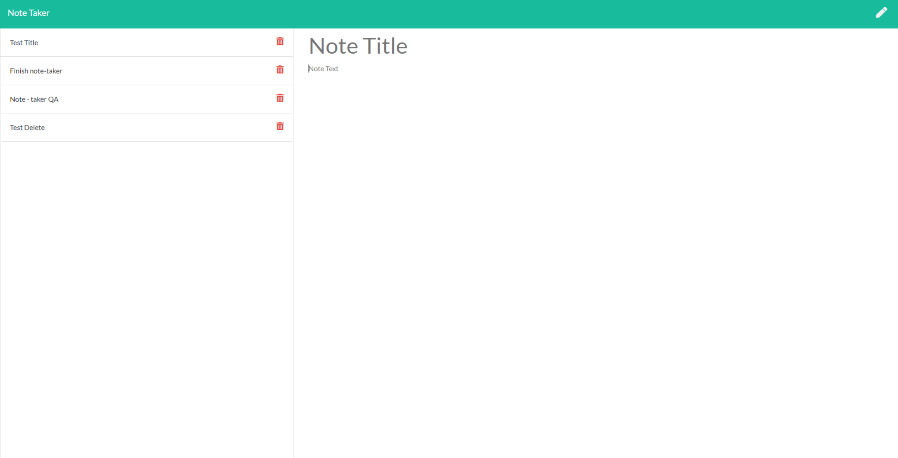

# note-taker

### Table Of Contents
* [Installation](#installation)
* [Usage](#usage)
* [Credits](#credits)
* [License](#license)

## Deployed Heroku URL
https://cryptic-cove-59138.herokuapp.com/

## Installation
Use 'npm install' to install all dependencies.

## Usage

### Run Command
Use 'node server' or 'npm start' from Command Line while inside the file directory to initialize server.

### Description
Note-taker is a server-side web application for making notes thats easy-to-use. There is currently not a dedicated server, so any notes taken will only persist as long as the user has the server initialized and running.

### Languages
Node.js, Express.js, JavaScipt, HTML, CSS 

### Tests
Use 'npm test' in CL to run test.
All tests are performed using Jest.js

### Tutorials

### Questions
##### GitHub
[Carrington13](https://github.com/Carrington13)
##### Email
caseyarrington13@gmail.com

## Credits

Front-end code ('./public') and initial dir structure- Provided by:
Trilogy Education 

Server/Back-end Code- By:
Casey Arrington

[Express.Router Guide](https://scotch.io/tutorials/learn-to-use-the-new-router-in-expressjs-4)
[Author: Chris Sev](https://scotch.io/@chris)

[License Badges and Links](https://gist.github.com/lukas-h/2a5d00690736b4c3a7ba)

## License
Copyright 2021 Casey Arrington

Permission is hereby granted, free of charge, to any person obtaining a copy of this software and associated documentation files (the "Software"), to deal in the Software without restriction, including without limitation the rights to use, copy, modify, merge, publish, distribute, sublicense, and/or sell copies of the Software, and to permit persons to whom the Software is furnished to do so, subject to the following conditions:

The above copyright notice and this permission notice shall be included in all copies or substantial portions of the Software.

THE SOFTWARE IS PROVIDED "AS IS", WITHOUT WARRANTY OF ANY KIND, EXPRESS OR IMPLIED, INCLUDING BUT NOT LIMITED TO THE WARRANTIES OF MERCHANTABILITY, FITNESS FOR A PARTICULAR PURPOSE AND NONINFRINGEMENT. IN NO EVENT SHALL THE AUTHORS OR COPYRIGHT HOLDERS BE LIABLE FOR ANY CLAIM, DAMAGES OR OTHER LIABILITY, WHETHER IN AN ACTION OF CONTRACT, TORT OR OTHERWISE, ARISING FROM, OUT OF OR IN CONNECTION WITH THE SOFTWARE OR THE USE OR OTHER DEALINGS IN THE SOFTWARE.

[Read More About MIT Here](https://opensource.org/licenses/MIT)

